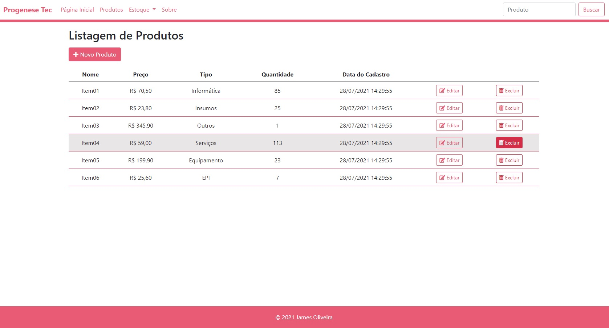
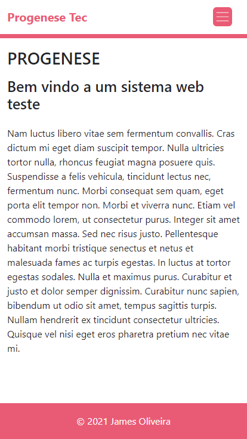
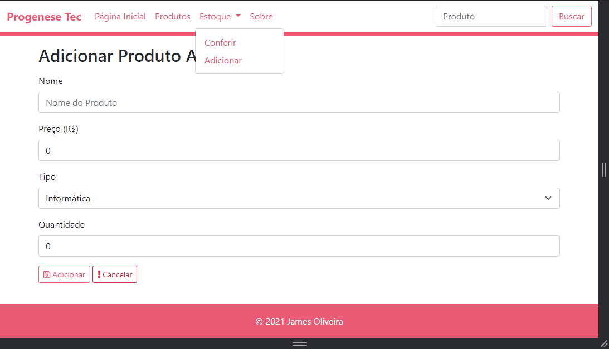

# Aplicação web com C# Asp.Net Bootstrap e Sql

> Sistema que adiciona itens a um estoque ou listagem, remove, edita, usando um banco de dados

## Imagens

  
  
    

  
  
    

  

## Resumo

O objetivo era desenvolver um sistema para ganhar experiencia com alguns frameworks, gerenciador NuGet, estrutura MVC e banco de dados;  

## Versões - Histórico

* 0.2.0
    * Atualização do front-end
    * Banco de Dados
* 0.1.0
    * Responsividade
    * Adição de conteúdo
* 0.0.1
    * Criação do sistema

## 

[https://github.com/JamesOliveira1](https://github.com/JamesOliveira1/)

